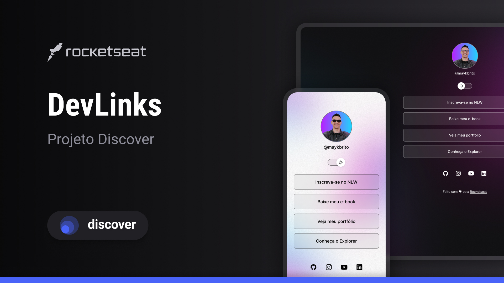

<h1 align="center"> DevLinks </h1>

Programa exclusivo e gratuito, promovido pela Rocketseat para ensino de tecnologias WEB.

  <a href="#-tecnologias">Tecnologias</a>&nbsp;&nbsp;&nbsp;|&nbsp;&nbsp;&nbsp;
  <a href="#-projeto">Projeto</a>&nbsp;&nbsp;&nbsp;|&nbsp;&nbsp;&nbsp;
  <a href="#-layout">Layout</a>&nbsp;&nbsp;&nbsp;|&nbsp;&nbsp;&nbsp;
  <a href="#memo-licença">Licença</a>

  

 

  

## 🚀 Tecnologias

Esse projeto foi desenvolvido com as seguintes tecnologias:

- HTML e CSS
- JavaScript
- Git e Github
- Figma

## 💻 Projeto

O DevLinks é um agregador de links para usar como cartão de visitas online.

## 🔖 Layout

Você pode visualizar o layout do projeto através [DESSE LINK](https://www.figma.com/community/file/1187422022288947321/duplicate). É necessário ter conta no [Figma](https://figma.com) para acessá-lo.

## 👩‍💻 Roteiro do curso

### Iniciando o HTML e CSS

- [X] Aplicando Background no Projeto
- [X] As caixas do HTML e CSS na prática
- [x] Centralizando uma caixa
- [x] Adcionando a imagem do perfil
- [x] Estilizando a imagem do perfil
- [x] Display none inline e block e alinhamento de elementos inline
- [x] Adicionando fontes e estilos aos textos
- [x] Reset de css
- [x] Ententendo margin padding
- [x] Criando lista em HTML
  
### Avançando o HTML e CSS

- [x] Conhecendo display flex
- [x] Alinhando elementos com flex
- [x] Aplicando propriedades modernas
- [x] Ajustando fontes dos links
- [x] Alterando propriedades com pseudo-selector hover
- [x] Analisando o código com a ferramenta do desenvolvedor DevTools
- [x] Adcionando ícones
- [x] Ajustando os links sociais
- [X] Criando o rodapé
- [X] Criando o HTML do botão switch e conhecendo o svg
- [X] Estilizando o botão e adicionando variação light mode
- [X] Estilizando o track
- [X] Posicionando elementos de maneira absoluta na página
- [X] Masterizando alinhamento e alinhando posiconamentos absolutos
- [X] Posiciionando o elemento na troca do light para o dark mode
- [X] Iniciando o light mode
- [X] Ajustes de light mode

### JavaScript

- [X] Algoritmos, Lógica de Programação e Sintaxe
- [X] Introudução ao JavaScript
- [X] Variáveis e Tipos de dados
- [X] Funções
- [X] Objetos
- [X] Adicionando lógica e condicional ao projeto
- [X] Atualizando atributos HTML com JavaScript 

## :memo: Licença

Esse projeto está sob a licença MIT.

---

Feito com ♥ by Rocketseat :wave: [Participe da nossa comunidade!](https://discord.gg/rocketseat)